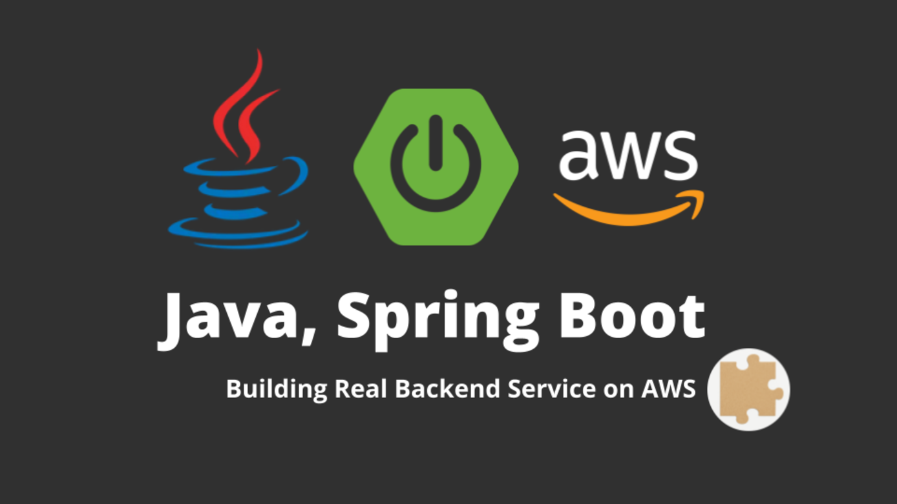
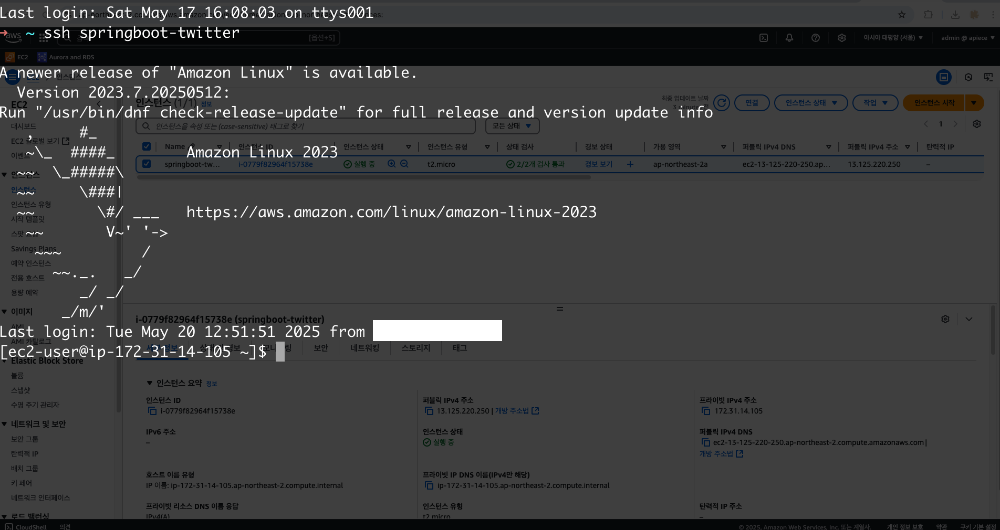
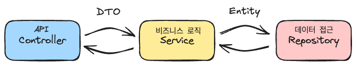
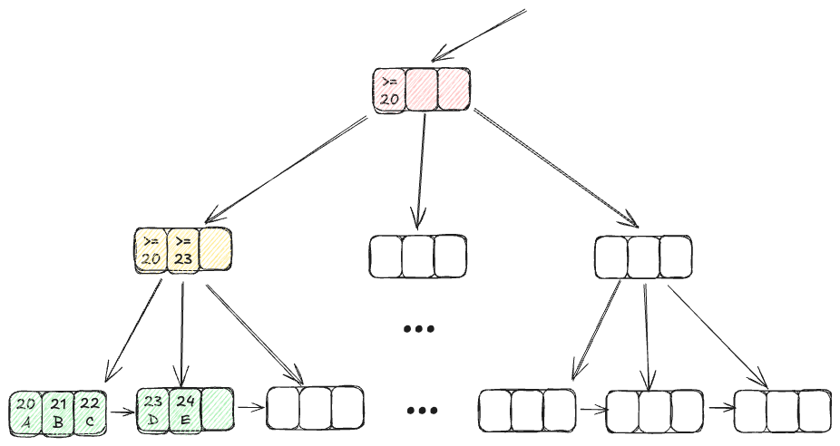

---

## 왜 이 강의를 들어야 할까요?

"내가 만들고 있는 백엔드 서비스 괜찮은걸까?"

아마 이런 고민, 한 번쯤 해보셨을 거예요. 
- **Spring Boot**로 프로젝트를 시작해보고 싶지만, 어디서부터 어떻게 시작해야 할지 막막했던 분,
- AWS, Docker, **클라우드 배포**라는 단어가 어렵게만 느껴졌던 분,
- 그리고, 내 손으로 만든 서비스를 진짜 세상에 띄워보고 싶은 모든 분께 이 강의를 추천합니다.

이 강의는 단순히 코드를 따라 치는 강의가 아닙니다. 
초반에는 백엔드 서비스를 빠르게 한 번 만든 뒤, 
후반에는 백엔드 개발자가 고민해야할 부분을 짚어드리며, 여러분이 직접 고민하고, 부딪히고, 해결하며 성장할 수 있도록 설계했습니다. 

---

## 이 강의를 들으면, 무엇이 달라질까요?

- **내가 만든 서비스가 진짜 인터넷에서 동작하는 경험**을 하게 됩니다. (AWS)
- 단순히 'API를 만들었다'가 아니라, **실제 서비스에서 쓰는 기술과 문제 해결법**을 몸으로 익힙니다.
- 'Spring Boot, JPA, Docker, AWS 실전 경험'을 자신 있게 가질 수 있게 됩니다.
- 무엇보다, "나도 할 수 있다"는 자신감이 생깁니다.

---

## 이 강의는 이런 분께 추천합니다

"Spring Boot로 백엔드 개발을 해보고 싶은데, 어디서부터 시작해야 할지 막막하다면? AWS에 내 서비스를 올려보고 싶은데, 클라우드가 어렵게만 느껴진다면?"

이 강의는 바로 그런 분들을 위해 준비했습니다. 

- **취업을 준비하는 분**
- **주니어 개발자**
- **실전 프로젝트 경험이 부족한 분** 

모두 환영합니다. 이 강의를 따라가다 보면, 어느새 내 손으로 SNS 백엔드 서비스를 만들고, 진짜 클라우드에 배포하는 경험까지 하게 될 거예요.

---

## 강의 전체 흐름, 이렇게 진행됩니다

### 1. 개발 환경 세팅부터, 내 첫 서버 실행까지

처음엔 누구나 어렵습니다. IntelliJ 설치부터, Spring Initializr로 프로젝트를 만드는 것까지 하나하나 따라가며 설명합니다. "내 컴퓨터에서 서버가 돌아가는 경험"을 직접 해보는 것, 이게 첫 번째 목표입니다.

- IntelliJ, JDK, Gradle 설치법
- Spring Boot 프로젝트 생성 실습
- 애플리케이션 실행, 콘솔에서 로그 확인하기

### 2. API가 뭔지, 직접 만들어보며 감 잡기

API라는 말, 많이 들어봤지만 직접 만들어본 적은 없을 수 있죠. 이 강의에서는 트위터 스타일의 게시글 API를 직접 만들어봅니다. 브라우저, Postman, curl로 내 서버에 요청을 보내보고, 응답을 받아보는 경험을 할 수 있습니다.

- REST API, HTTP, JSON의 개념을 쉽게 설명
- GET/POST/PUT/DELETE로 게시글 CRUD 실습
- API 테스트 자동화의 기초도 함께!

### 3. 데이터는 어디에 저장될까? MySQL과 JPA로 DB 연동

"서버를 껐다 켜도 데이터가 남아있을까?" 이 질문에 답하기 위해, 메모리 저장과 디스크(DB) 저장의 차이를 실습으로 보여줍니다. JPA와 MySQL을 연동하고, Docker로 개발환경을 빠르게 세팅하는 방법도 배웁니다.

- 메모리 vs 디스크 저장의 차이
- JPA, MySQL 연동 실습
- Docker로 MySQL 환경 구축
- 게시글을 DB에 저장하고, 껐다 켜도 남는 데이터 경험

### 4. Docker로 내 서비스를 컨테이너에 담아보기

"내 컴퓨터에서는 잘 되는데..."라는 말, 들어보셨죠? Docker를 배우면 이런 걱정이 사라집니다. 내 앱을 컨테이너 이미지로 만들고, Docker Compose로 여러 서비스를 한 번에 실행하는 방법을 익힙니다. Docker Hub에 이미지를 올리고, 다른 환경에서 바로 내려받아 실행하는 경험도 해봅니다.

- Docker, 컨테이너, 이미지 개념 쉽게 설명
- Spring Boot 앱 Docker 이미지 만들기
- Docker Compose로 앱+DB 한 번에 실행
- Docker Hub 업로드/다운로드 실습

### 5. AWS 클라우드에 내 서비스 띄우기

"진짜 인터넷에서 내 서비스가 돌아간다!" 이 감동을 느껴보세요. AWS EC2 서버를 만들고, 리눅스 명령어도 직접 써봅니다. Docker Compose로 서버에 서비스를 배포하고, MySQL을 RDS로 분리해 클라우드 DB까지 연동하는 실습을 합니다.

- AWS EC2 서버 생성, 리눅스 기본 명령어 실습
- Docker Compose로 서버에 서비스 배포
- MySQL을 RDS로 분리, 클라우드 DB 연동
- 진짜 인터넷에서 서비스가 동작하는 경험

### 6. SNS 기능 완성! 게시글, 댓글, 무한스크롤까지

실제 SNS에서 쓰는 기능을 내 손으로 구현해봅니다. 게시글 페이지네이션, 무한스크롤, 댓글 기능까지 하나씩 따라가며 만들 수 있습니다. JPA의 N+1 문제, 트랜잭션, 인덱스 등 실무에서 꼭 알아야 할 DB 이슈도 함께 다룹니다.

- 게시글 페이지네이션, 무한스크롤 구현
- 댓글 기능 설계/구현 (DTO, 엔티티, 서비스, 컨트롤러)
- JPA의 N+1 문제, 트랜잭션, 인덱스 등 실무적 DB 이슈

---

## 이 강의의 진짜 장점

- **실전 중심**: 이론보다 실습! 직접 코드를 짜고, 실행하고, 결과를 확인합니다.
- **최신 기술 스택**: Java 21, Spring Boot 3, Docker, AWS, JPA 등 실무에서 바로 쓰는 기술을 경험합니다.
- **실제 배포 경험**: 내 코드를 클라우드에 올려, 진짜 서비스로 운영해봅니다.
- **문제 해결력 강화**: N+1, 트랜잭션, 인덱스 등 실무에서 마주치는 문제를 직접 해결하며 성장합니다.

---

## 마지막으로

이 강의는

**초반부**에 "따라만 해도 실력이 늘도록" 애플리케이션 개발과 배포까지 진행하며 **빠른 성취**를 만들었고,
**후반부**에는 "조금 더 깊게 고민해볼 수 있도록" 서비스에 기능을 추가하고 개선하면서 **백엔드 개발자가 고민해야할 부분**에 대해 다루었습니다.

처음엔 어렵게 느껴질 수 있지만, 한 단계씩 따라가다 보면 어느새 내 손으로 서비스를 만들고, 배포하고, 운영하는 자신을 발견하게 될 거예요. 

이 강의를 통해 함께 성장했으면 좋겠습니다. 감사합니다.

