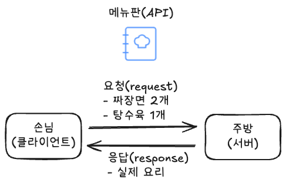
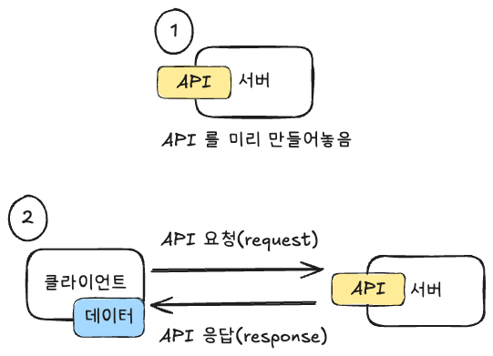

# API, 왜 필요한가요?


트위터를 생각해보겠습니다.

브라우저를 통해 트위터를 접속해볼까요? 첫 화면에 여러 게시글이 보입니다. 게시글에는 작성자의 프로필 이미지도 보이고, 작성일도 보이네요.

이런 데이터는 어디에 저장되어 있을까요? 바로, 서버입니다.

즉, 브라우저는 서버로부터 받아온 게시글 데이터를 조합해서 사용자에게 보여주고 있는 것입니다.

서버로부터 이 데이터를 받아오기 위해서는 API 가 필요합니다.


# 1. API란 무엇인가요?

API는 **웹 서비스에서 데이터를 주고받기 위한 규칙이나 도구**입니다.
API는 Application Programming Interface 의 줄임말이며, 애플리케이션 프로그래밍(우리 서비스)이 클라이언트(외부 손님)와 어떻게 의사소통할지 정해주는 명세서(인터페이스)라고 생각하시면 됩니다.


비유를 들자면,

API는 식당의 메뉴판 같은 거예요. 
메뉴판에는 주문할 수 있는 음식이 있습니다. 손님이 메뉴판을 읽고 주문 요청을 하면 주방에서는 음식을 손님에게 가져다줍니다. 

메뉴판과 마찬가지로 API는 프로그램끼리 "이런 데이터를 이런 방식으로 달라"고 요청하고 받을 수 있게 해주는 규칙이 있습니다. 클라이언트가 API 를 통해 특정 요청을 하면 서버는 데이터를 클라이언트에게 응답해줍니다.



"서버가 API 를 제공한다" 라는 말은 곧, "주방에서 메뉴판을 제공한다" 라고 이해하시면 됩니다.


### API 간단한 예시로 이해하기

**쇼핑몰 상품 조회 API**

```yaml
GET http://shoppingmall.com/api/products
```

- 이 주소로 요청을 보내면 상품 목록을 받아올 수 있습니다.
- 서버는 상품 목록을 응답하도록 미리 구현해야 합니다.


**트위터 글 쓰기 API**

```yaml
POST http://twitter.com/api/posts
```

- 이 주소로 새로운 게시물을 작성할 수 있습니다.
- 서버는 게시물을 저장하도록 미리 구현해야 합니다.


# 2. HTTP란 무엇인가요?

http 는 우리에게 익숙한 단어이죠. 브라우저 주소창에서 본 링크는 대부분 https://www.naver.com 이런식으로 시작하니까요.

사실 위 그림에 나오는 흐름은 HTTP 요청, 응답을 나타낸 것입니다. HTTP 는 인터넷에서 오고가는 통신의 규칙(프로토콜) 중 하나입니다.
HTTP는 Hypertext Transfer Protocol 의 줄임말로, **웹 브라우저와 서버가 하이퍼텍스트, 즉 웹 페이지의 내용을 주고받을 때 사용하는 규칙**입니다


#### HTTP의 작동 방식

**웹 브라우저가 서버에 요청을 보내고, 서버가 그 요청에 대한 응답을 반환하는 방식**으로 작동합니다. 

예를 들어, 웹사이트를 방문하면 브라우저가 서버에 페이지를 요청하고, 서버는 해당 페이지의 내용(HTML, JSON 등의 파일)을 반환합니다.


#### HTTP 구조

**요청**

```yaml
<요청 라인>
<헤더들>
<빈 줄>
<본문(Body) (옵션)>

GET /api/v1/products HTTP/1.1
Host: shoppingmall.com
User-Agent: Mozilla/5.0
Accept: application/json
```

**응답**

```yaml
<상태 라인>
<헤더들>
<빈 줄>
<본문(Body)>

HTTP/1.1 200 OK
Content-Type: application/json
Content-Length: 152


{
  "id": 1,
  "name": "Red T-shirt",
  "price": 19900
}
```

중요 요소

- HTTP 메서드
- HTTP 버전
- HTTP 상태 코드
- HTTP 헤더
- HTTP 바디 (본문)

우리가 자주 사용하는 HTTP 요소들은 아래 REST API 에서 다루어보겠습니다.


#### HTTP의 주요 특징

**클라이언트-서버 모델**: 웹 브라우저(클라이언트)가 요청을 보내고, 서버가 응답을 반환하는 구조입니다. 

**비연결성(Connectionless)**: HTTP 요청이 완료되면 클라이언트와 서버 연결은 유지되지 않고 종료됩니다. 즉, 한 번의 요청이 1회성이라고 생각해주시면 됩니다.

**무상태성(Stateless)**: 클라이언트 또는 서버는 이전 요청의 상태를 기억(저장)하지 않습니다. 


# 3. REST API란 무엇이고, 왜 좋을까요?

### REST API란?

REST API는 **웹에서 데이터를 주고받기 위한 규칙**입니다.
(REST는 "Representational State Transfer"의 줄임말로 서버에 있는 자원의 정보(상태)를 클라이언트에게 전달하는 방식이라고 생각하시면 됩니다.)

우리는 웹에서 주소(URL)를 입력해서 페이지를 여는 것처럼, REST API는 **특정한 주소와 방식을 조합해서 서버와 소통**할 수 있습니다.


### REST API의 기본 규칙 (꼭 알아야 할 핵심 4가지)

1. **자원(Resource)은 URL로 표현한다**

   URL은 어떤 "데이터"를 요청하는지를 나타내야 합니다.

   예: `/api/products`는 "상품"이라는 자원을 의미합니다.

2. **행동(Action)은 HTTP 메서드로 표현한다**

   어떤 동작을 할지 정해진 방식으로 표현합니다.

   - `GET` : 가져오기 (조회)
   - `POST` : 새로 만들기 (등록)
   - `PUT` : 수정하기 (전체 수정)
   - `PATCH` : 일부 수정하기
   - `DELETE` : 삭제하기

3. **자원에는 명사를 사용하고, 동사는 쓰지 않는다**

   `GET /api/getProducts` 는 동사를 사용하므로 추천하지 않고,

   `GET /api/products` 는 명사를 자원으로 사용하므로 이렇게 사용하는 것을 추천합니다.

4. **서버는 요청 결과에 따라 적절한 HTTP 상태 코드를 반환해야 한다**

   웹 개발자가 자주 사용하는 HTTP 상태 코드입니다.

   - `200 OK` : 요청 성공
   - `201 Created` : 생성 성공
   - `400 Bad Request` : 잘못된 요청
   - `401 Unauthorized` : 인증 실패
   - `404 Not Found` : 자원 없음
   - `500 Internal Server Error` : 서버 에러 등

   400번대 에러는 주로 클라이언트가 규칙을 위반했을 경우를 말하며, 500에러는 서버 내부에 문제가 있을 때를 말합니다.

   백엔드 개발자는 500 에러 발생시 적절한 대응을 꼭 해주는게 바람직합니다.


### 쇼핑몰 상품 목록 보기 예시 (상세)




#### 1. 클라이언트 → 서버 : **HTTP 요청**

```yaml
GET /api/products HTTP/1.1
Host: shoppingmall.com
Accept: application/json
```

#### 2. 서버 → 클라이언트 : **HTTP 응답**

```yaml
HTTP/1.1 200 OK
Content-Type: application/json

[
  {
    "id": 1,
    "name": "무선 이어폰",
    "price": 129000,
    "stock": 23
  },
  {
    "id": 2,
    "name": "게이밍 키보드",
    "price": 79000,
    "stock": 12
  }
]
```

클라이언트가 `/api/products`에 GET 요청을 보내면, 서버는 상품 목록(JSON 형식)을 응답합니다.


### 트위터 글 쓰기 예시 (상세)

#### 1. 클라이언트 → 서버 : **HTTP 요청**

```yaml
POST /api/posts HTTP/1.1
Host: twitter.com
Content-Type: application/json

{
  "author": "apiece",
  "content": "오늘 날씨 너무 좋다 ☀️",
  "timestamp": "2025-04-20T14:23:00Z"
}
```

#### 2. 서버 → 클라이언트 : **HTTP 응답**

```yaml
HTTP/1.1 201 Created
Content-Type: application/json

{
  "id": 101,
  "author": "apiece",
  "content": "오늘 날씨 너무 좋다 ☀️",
  "timestamp": "2025-04-20T14:23:00Z"
}
```

클라이언트가 `/api/posts`에 게시글 데이터를 담아 POST 요청을 보내면, 서버는 그 글을 저장하고 저장된 정보를 JSON 형식으로 응답합니다. 응답 상태 코드 `201 Created`는 "요청에 따라 자원이 성공적으로 생성되었음"을 의미합니다.


> ### 💡 JSON이란?
>
> JSON은 JavaScript Object Notation의 줄임말로, **데이터를 주고받기 위한 약속된 형식**입니다.
>
> `"이름": "값"` 구조로 깔끔하게 정리할 수 있습니다. 이렇게 키-값(key-value) 쌍으로 나타내어 정보를 쉽고 빠르게 확인할 수 있습니다.
>
> 위에 있는 예시처럼 직관적으로 사람이 이해하기 좋은 형식이어서 웹 개발에서 많이 사용됩니다.


### REST API의 버전 관리

API는 한 번 만들어지면 여러 사용자나 서비스가 사용하게 됩니다. 그런데 시간이 지나면서 구조를 바꾸거나 기능을 개선하고 싶을 때가 생기죠.
이때 **기존 사용자에게 영향을 주지 않으면서 새로운 기능을 추가하려면, 버전 관리**를 하면 도움이 많이 됩니다.
특히, 내부 전용 API 가 아닌 외부에 공개되는 API 라면 버전을 통해 안전하게 API를 관리할 수 있습니다.

> 예:
>
> - `GET /api/v1/products` → 기존 방식
> - `GET /api/v2/products` → 새롭게 바뀐 방식

이렇게 하면 기존 사용자에게 오류 없이 서비스 유지 가능함과 동시에, 새로운 API 설계도 자유롭게 실험 가능하고 안전하게 배포가 가능합니다.


### REST API의 장점

**웹의 언어를 그대로 활용한 쉬운 소통 방식**

REST는 웹의 기본 언어인 HTTP를 그대로 사용합니다. 예를 들어 새로운 나라에 갔는데, 그 나라 사람들이 모두 영어를 사용한다면 의사소통이 훨씬 쉬워지겠죠? REST는 그런 느낌입니다.

**다양한 기기와 환경에서도 일관된 접근 방식**

REST API는 스마트폰, 태블릿, 웹사이트(브라우저) 등 다양한 기기와 환경에서 동일한 방식으로 사용할 수 있습니다. 이는 개발자들이 한 번 만든 API를 여러 플랫폼에서 재사용할 수 있게 해주어, 개발 효율성을 높여줍니다.
예를 들어 USB 포트처럼, 어떤 기기든 USB를 지원하면 동일한 케이블로 연결할 수 있듯이, REST API도 다양한 환경에서 동일한 방식으로 작동합니다.

