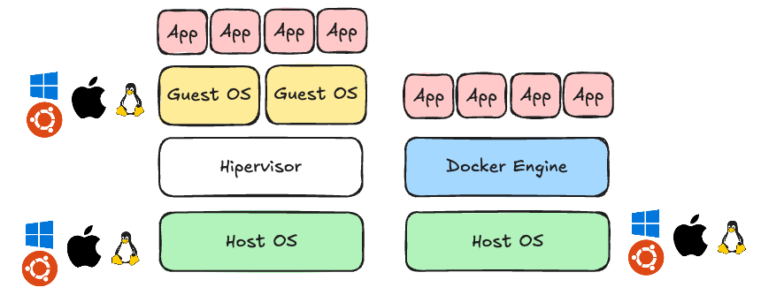
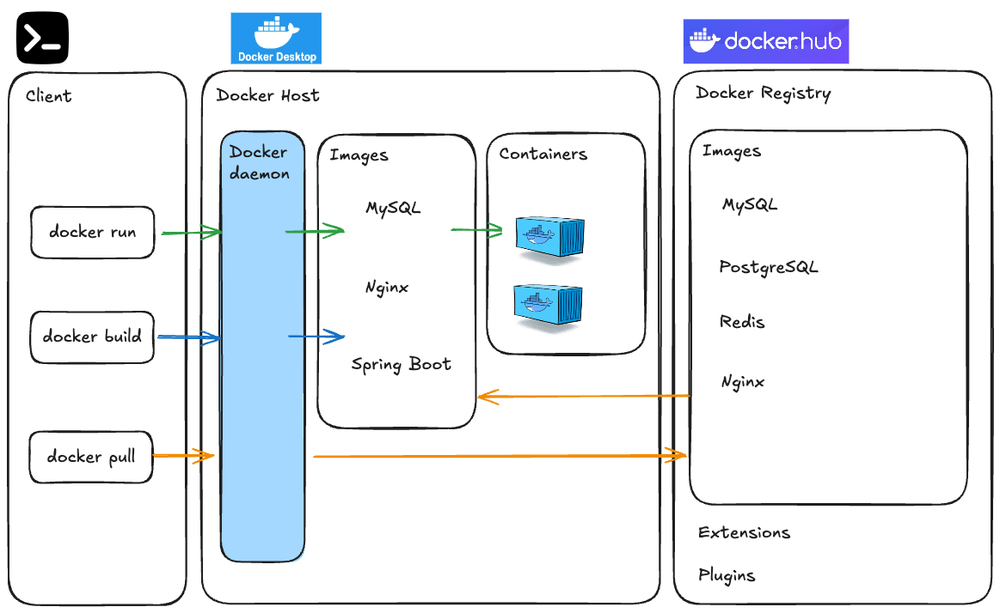

# Docker란 무엇인가요?

Docker는 애플리케이션을 개발, 배포, 실행하기 위한 오픈 플랫폼입니다. Docker를 사용하면 애플리케이션을 인프라에서 분리하여 소프트웨어를 빠르게 제공할 수 있습니다.


# 1. Docker의 핵심 개념

**컨테이너(Container)**: 애플리케이션과 그 실행에 필요한 모든 파일과 설정을 포함하는 독립적인 실행 환경입니다. 가상머신보다 가볍고 빠르게 시작할 수 있습니다.

**이미지(Image)**: 컨테이너를 생성하기 위한 읽기 전용 템플릿입니다. 애플리케이션 코드, 런타임, 라이브러리, 도구 등이 포함됩니다.

**Dockerfile**: 이미지를 빌드하기 위한 지침이 포함된 텍스트 파일입니다.

**Docker Hub**: Docker 이미지를 공유하고 다운로드할 수 있는 공개 레지스트리입니다.


## Docker의 장점

**일관성**: "내 컴퓨터에서는 잘 되는데..."라는 문제를 해결합니다. 개발, 테스트, 운영 환경이 동일하게 유지됩니다.

**이식성**: 한 환경에서 다른 환경으로 쉽게 이동할 수 있습니다.

**격리**: 각 애플리케이션이 독립적인 환경에서 실행되어 충돌을 방지합니다.

**효율성**: 가상머신보다 적은 리소스를 사용하고 빠르게 시작/종료할 수 있습니다.

**확장성**: 마이크로서비스 아키텍처에 적합하며, 필요에 따라 쉽게 확장할 수 있습니다.


# 2. Docker vs 가상머신



### 가상머신(VM)의 구조

가상머신은 호스트 OS 위에 하이퍼바이저를 설치하고, 그 위에 게스트 OS를 실행합니다. **각 가상머신은 자체 OS를 가지고 있어 리소스를 많이 사용**합니다.

### Docker의 구조

Docker는 **호스트 OS의 커널을 공유**하고, 애플리케이션과 필요한 라이브러리만 컨테이너에 포함시킵니다. **OS를 포함하지 않기 때문에 가볍고 빠릅니다.**

### 비교

| 특성              | 가상머신 (VM)                                 | Docker 컨테이너                             |
| ----------------- | --------------------------------------------- | ------------------------------------------- |
| **크기**          | 일반적으로 수 GB (OS 포함)                    | 수십 \~ 수백 MB (애플리케이션 중심)         |
| **시작 시간**     | 수십 초 \~ 수 분 (OS 부팅 필요)               | 수 초 내외 (애플리케이션 실행만 필요)       |
| **리소스 사용량** | 전체 OS 및 커널 실행으로 메모리/CPU 사용 많음 | 커널 공유로 메모리/CPU 사용 최소화          |
| **격리 수준**     | 하이퍼바이저 기반 완전한 격리                 | 프로세스 수준의 논리적 격리                 |
| **이식성**        | 하이퍼바이저 호환 여부에 따라 다름            | 동일한 이미지로 다양한 환경에서 실행 가능   |
| **운영체제**      | 각 VM마다 독립된 OS 필요                      | 호스트 OS와 커널 공유 (Linux 계열에 최적화) |
| **속도**          | 느림 (무거운 OS, 부팅 시간 등)                | 빠름 (애플리케이션 단위로 실행)             |
| **유지관리**      | VM마다 OS 업데이트, 패치 필요                 | 이미지 기반으로 통합 관리 및 재배포 가능    |


# 3. Docker 구조



### 1. **Docker Daemon (`dockerd`)**

- 백그라운드에서 실행되는 프로세스
- 컨테이너와 이미지 관리
- Docker API 요청 처리
- CLI 명령을 처리

### 2. **Docker Client (`docker`)**

- 사용자가 직접 명령을 내리는 인터페이스 (`docker run`, `docker build` 등)
- Docker Daemon과 REST API를 통해 통신 (단, TCP/IP 네트워크 통신이 아닌 unix socket 파일 시스템 통신)

### 3. **Docker Images**

- 컨테이너의 실행에 필요한 모든 요소(코드, 런타임, 라이브러리 등)를 포함한 템플릿
- `Dockerfile`을 이용해 생성

### 4. **Docker Containers**

- 이미지에서 실행되는 독립된 실행 환경
- 가볍고 빠름
- 격리된 상태에서 실행됨

### 5. **Docker Registries**

- 이미지 저장소
- Public: Docker Hub
- Private registry도 구성 가능
- 이미지를 pull(가져오기) 하거나 push(올리기) 할 수 있음


참고) 도커 구조 공식문서 https://docs.docker.com/get-started/docker-overview/#docker-architecture


# 4. Docker 기본 명령어

### Docker 버전 확인

```bash
docker --version
```

### 이미지 관련 명령어

```bash
# 이미지 목록 확인
docker images

# 이미지 다운로드
docker pull [이미지명]:[태그]
docker pull nginx:1.28.0

# 이미지 삭제
docker rmi [이미지명]:[태그]
docker rmi nginx:1.28.0
```

- Nginx는 빠르고 가벼운 웹 서버이자, 리버스 프록시 및 로드 밸런서로도 많이 쓰이는 소프트웨어입니다.


### 컨테이너 관련 명령어

```bash
# 컨테이너 실행
docker run [옵션] [이미지명]:[태그]
# Nginx 이미지 다운로드 및 실행
docker run -d -p 80:80 --name nginx-twitter nginx:1.28.0

# 브라우저에서 http://localhost 접속하여 확인
```

- `-d`: 백그라운드에서 실행
- `-p 80:80`: 호스트의 80번 포트를 컨테이너의 80번 포트에 연결
- `--name my-nginx`: 컨테이너 이름 지정
- `nginx`: 사용할 이미지


```bash
# 실행 중인 컨테이너 목록 확인
docker ps

# 모든 컨테이너 목록 확인 (중지된 컨테이너 포함)
docker ps -a

# 컨테이너 로그 확인
docker logs [컨테이너ID 또는 이름]
docker logs nginx-twitter

# 컨테이너 중지
docker stop [컨테이너ID 또는 이름]
docker stop nginx-twitter

# 컨테이너 삭제
docker rm [컨테이너ID 또는 이름]
docker rm nginx-twitter
```


