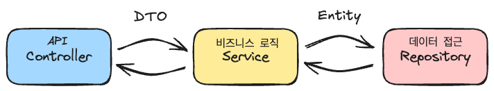

# 댓글 기능 구현하기

SNS에서 가장 중요한 기능 중 하나인 댓글 기능을 구현해보겠습니다. 댓글은 사용자들이 서로 소통하고 의견을 나눌 수 있게 해주는 핵심 기능입니다.


## 1. 댓글 기능의 설계

먼저 댓글 기능을 어떻게 만들지 설계해보겠습니다. 댓글에는 다음과 같은 정보가 필요합니다
- 댓글 ID
- 댓글 내용
- 게시글 ID (어떤 게시글의 댓글인지)
- 작성 시간
- 수정 시간


### Comment 엔티티 만들기

```java
@Table(name = "comments")
@Entity
@Getter
@Builder
@AllArgsConstructor
@NoArgsConstructor(access = AccessLevel.PROTECTED)
public class Comment {
    @Id
    @GeneratedValue(strategy = GenerationType.IDENTITY)
    private Long id;

    @Column(nullable = false, columnDefinition = "TEXT")
    private String content;

    @Column(nullable = false)
    private Long postId;

    @Column(nullable = false)
    private LocalDateTime createdAt;

    @Column(nullable = false)
    private LocalDateTime updatedAt;

    public void updateContent(String content) {
        this.content = content;
    }
}
```


## 2. 게시글과 댓글 연결하기

게시글과 댓글은 ID로 연결됩니다. 한 게시글에는 여러 개의 댓글이 달릴 수 있습니다.

```java
@Table(name = "posts")
@Entity
@Getter
@Setter
@Builder
@AllArgsConstructor
@NoArgsConstructor(access = AccessLevel.PROTECTED)
public class Post {

    @Id
    @GeneratedValue(strategy = GenerationType.IDENTITY)
    private Long id;

    private String content;
  
    private int commentCount;

    private LocalDateTime createdAt;
  
    private LocalDateTime updatedAt;

    public void updateContent(String content) {
        this.content = content;
    }

    public void increaseCommentCount() {
        this.commentCount++;
    }

    public void decreaseCommentCount() {
        this.commentCount--;
    }
}
```

- `@AllArgsConstructor` 덕분에 필드가 추가되어도 모든 필드를 가진 생성자가 자동 생성됩니다. 하지만 기존 생성자를 사용하는 부분은 컴파일에러가 발생합니다. `@Builder` 를 추가하고 Post 생성자를 사용하고 있는 부분을 빌더 패턴으로 수정합니다.
- 추가로 JPA 에서 사용하는 기본 생성자는 protected 로 해도 사용이 가능합니다. 서비스 개발자들은 이 기본생성자의 사용을 막기 위해서 보수적으로 protected 로 설정합니다. 되도록 Builder 나 다른 생성자를 통해 Post 객체를 만들도록 하여 코드 유지보수성을 향상시킵니다.

```java
// PostController.java
Post newPost = Post.builder()
                .content(post.getContent())
                .createdAt(LocalDateTime.now())
                .updatedAt(LocalDateTime.now())
                .build();
```


## 3. 댓글 저장소 만들기

댓글을 데이터베이스에 저장하고 불러오는 기능을 만들어보겠습니다.

```java
public interface CommentRepository extends JpaRepository<Comment, Long> {
    // 특정 게시글의 모든 댓글을 시간 순으로 가져오기
    List<Comment> findByPostIdOrderByIdDesc(Long postId);
  
    Optional<Comment> findByIdAndPostId(Long commentId, Long postId);
}
```


## 4. 댓글 요청/응답 DTO 만들기

### DTO는 왜 사용할까?



우리는 계층구조(Layered Architecture)를 사용하고 있었습니다.

여기서 계층은 Controller, Service, Repository 로 나뉘어집니다.

Service 와 Repository 는 `Entity` 를 주고 받으면서 데이터를 저장하고 조회할 수 있었습니다.

Controller와 Service 사이에서는 `DTO(Data Transfer Object)`를 만들어 계층 간 데이터 전달을 담당할 수 있습니다.


DTO를 사용하는 이유는 다음과 같습니다.

#### 1) 계층 간 역할 분리

- 비즈니스 로직을 포함하는 Entity와 분리함으로써, 각 **계층의 책임을 명확하게 구분**할 수 있습니다.

#### 2) API 보안 및 유연성 향상

- DTO는 필요한 필드만 포함하여 외부에 노출할 수 있습니다. 
  Entity에는 민감한 정보나 외부에 보여주지 않아야 할 정보가 포함될 수 있으므로,  이를 그대로 반환할 경우 **보안상 문제**가 발생할 수 있습니다.
- 또한 Entity의 구조가 변경되더라도 DTO를 통해 외부 API의 형태는 그대로 유지할 수 있어, **클라이언트에 영향을 주지 않고 내부 구조를 자유롭게 변경**할 수 있습니다.

#### 3) 유효성 검사와 응답 가공의 용이성

- 요청 DTO는 입력값에 대한 **유효성 검사를 용이**하게 만들어줍니다. 
  예를 들어, 필수값 검증, 길이 제한, 형식 검증 등을 어노테이션 기반으로 쉽게 처리할 수 있습니다.
- 응답 DTO는 Entity를 그대로 반환하는 대신, **클라이언트가 필요로 하는 형태로 가공**하여 전달할 수 있습니다.  


### DTO 만들기

댓글 API에서 사용할 요청/응답 DTO 클래스 만듭니다.

 Java record로 만들면 롬복의 도움없이 아래 기능을 가지는 불변 객체를 쉽게 만들 수 있습니다. 

- 각 필드는 `private final`, getter 생성
- 모든 필드를 가지는 생성자
- `equals()`, `hashcode()`, `toString()`
- final class (상속 불가 클래스)

```java
// 댓글 작성/수정 요청용 DTO
public record CommentRequest(
    String content
) {}

// 댓글 응답용 DTO
public record CommentResponse(
    Long id,
    String content,
    LocalDateTime createdAt,
    LocalDateTime updatedAt
) {
    public static CommentResponse from(Comment comment) {
        return new CommentResponse(
            comment.getId(),
            comment.getContent(),
            comment.getCreatedAt(),
            comment.getUpdatedAt()
        );
    }
}
```


## 5. 댓글 서비스 만들기

이제 실제로 댓글을 작성하고, 수정하고, 삭제하는 기능을 만들어보겠습니다.

```java
@Service
@RequiredArgsConstructor
public class CommentService {
    private final CommentRepository commentRepository;
    private final PostRepository postRepository;

    public CommentResponse createComment(Long postId, CommentRequest request) {
        Post post = postRepository.findById(postId)
                .orElseThrow(() -> new IllegalArgumentException("게시글을 찾을 수 없습니다"));

        Comment comment = Comment.builder()
                .content(request.content())
                .postId(postId)
                .createdAt(LocalDateTime.now())
                .updatedAt(LocalDateTime.now())
                .build();

        Comment savedComment = commentRepository.save(comment);
        post.increaseCommentCount();
        postRepository.save(post);

        return CommentResponse.from(savedComment);
    }

    public List<CommentResponse> getComments(Long postId) {
        return commentRepository.findByPostIdOrderByIdDesc(postId)
                .stream()
                .map(CommentResponse::from)
                .toList();
    }

    public CommentResponse updateComment(Long postId, Long commentId, CommentRequest request) {
        Comment comment = commentRepository.findByIdAndPostId(commentId, postId)
                .orElseThrow(() -> new IllegalArgumentException("댓글을 찾을 수 없습니다"));

        comment.update(request.content());
        commentRepository.save(comment);
        return CommentResponse.from(comment);
    }

    public void deleteComment(Long postId, Long commentId) {
        Comment comment = commentRepository.findByIdAndPostId(commentId, postId)
                .orElseThrow(() -> new IllegalArgumentException("댓글을 찾을 수 없습니다"));

        Post post = postRepository.findById(comment.getPostId())
                .orElseThrow(() -> new IllegalArgumentException("게시글을 찾을 수 없습니다"));

        post.decreaseCommentCount();
        postRepository.save(post);
        commentRepository.delete(comment);
    }
}
```


## 6. API 만들기

마지막으로 클라이언트가 댓글 기능을 사용할 수 있도록 API를 만들어보겠습니다.

```java
@RestController
@RequestMapping("/api/posts/{postId}/comments")
@RequiredArgsConstructor
public class CommentController {
    private final CommentService commentService;

    @PostMapping
    public CommentResponse createComment(
            @PathVariable Long postId,
            @RequestBody CommentRequest request
    ) {
        return commentService.createComment(postId, request);
    }

    @GetMapping
    public List<CommentResponse> getComments(@PathVariable Long postId) {
        return commentService.getComments(postId);
    }

    @PutMapping("/{commentId}")
    public CommentResponse updateComment(
            @PathVariable Long postId,
            @PathVariable Long commentId,
            @RequestBody CommentRequest request
    ) {
        return commentService.updateComment(postId, commentId, request);
    }

    @DeleteMapping("/{commentId}")
    public void deleteComment(
            @PathVariable Long postId,
            @PathVariable Long commentId
    ) {
        commentService.deleteComment(postId, commentId);
    }
}
```


## 7. 실제 사용해보기

이제 우리가 만든 댓글 기능을 실제로 어떻게 사용하는지 알아보겠습니다.

### 새로운 댓글 작성하기
```bash
curl -X POST http://localhost:8080/api/posts/20/comments \
     -H "Content-Type: application/json" \
     -d '{"content": "정말 좋은 게시글이네요!"}'
```


### 댓글 목록 가져오기

```bash
curl http://localhost:8080/api/posts/20/comments
```


### 댓글 수정하기

```bash
curl -X PUT http://localhost:8080/api/posts/20/comments/2 \
     -H "Content-Type: application/json" \
     -d '{"content": "수정된 댓글입니다!"}'
```

### 댓글 삭제하기
```bash
curl -X DELETE http://localhost:8080/api/posts/20/comments/1
```


## 8. 생각해볼 점

**데이터 검증**: 댓글 내용이 비어있지 않은지, 적절한 길이인지 확인해야 합니다.

**객체 관계 맺기** : JPA 를 사용한만큼, 연관 관계를 맺어 엔티티를 자바 프로그래밍에서 객체를 다루듯 비슷하게 사용할 수 있습니다.

**성능 최적화** : 객체 관계를 맺음으로서 발생하는 N + 1문제에 대해서 생각해보고, 해결해봅니다.

**트랜잭션 관리** : 만약 댓글 생성시, 댓글만 생성되고 게시글에 있는 댓글개수 변경은 실패하면 어떻게 처리해야할까요? 이 부분을 하나로 묶을 수 있도록 트랜잭션 처리를 할 수 있는지 생각해야 합니다.
