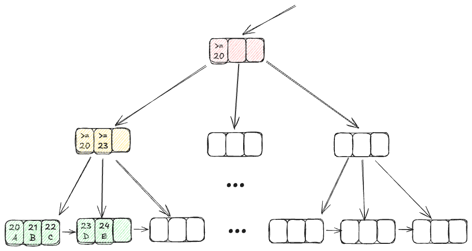

# 게시글, 댓글 주의사항


## 1. 입력 데이터 검증

- 댓글 내용의 길이 제한을 설정해야 합니다.

```java
import javax.validation.constraints.NotBlank;
import javax.validation.constraints.Size;

public record CommentRequest(
    @NotBlank(message = "댓글 내용은 비어있을 수 없습니다")
    @Size(min = 1, max = 50, message = "댓글은 1자 이상 50자 이하여야 합니다")
    String content
) {}
```

```java
// 컨트롤러에서 유효성 검증
@PostMapping
public CommentResponse createComment(
        @PathVariable Long postId,
        @Valid @RequestBody CommentRequest request
) {
    // 유효성 검증을 통과한 요청만 처리
    return commentService.createComment(postId, request);
}
```


위 어노테이션을 사용하려면 아래 의존성 라이브러리를 추가해야합니다.

**build.gradlew.kts**

```kotlin
dependencies {
    implementation("org.springframework.boot:spring-boot-starter-validation")
}
```


**검증**

유효하지 않은 데이터가 들어오면 400응답 (Bad Request) 이 나오는지 검증합니다.

```bash
curl -X POST http://localhost:8080/api/posts/20/comments \
     -H "Content-Type: application/json" \
     -d '{"content": ""}'
```

```bash
curl -X POST http://localhost:8080/api/posts/20/comments \
     -H "Content-Type: application/json" \
     -d '{"content": "정말 유익한 게시글입니다. 필요한 정보를 명확하게 설명해주셔서 많은 도움이 되었습니다. 감사합니다! 50자 이상의 댓글입니다."}'
```


## 2. 객체 관계 맺기

### 관계 설정

- 댓글과 게시글은 N:1 관계인데, ORM (Object Relation Mapping) 의 장점을 살려서 `@ManyToOne` 관계로 객체그래프를 나타낼 수 있습니다.
- `@ManyToOne` 외에 JPA에는 `@OneToMany`,  `@ManyToMany`, `@OneToOne`, 양방향 매핑 등도 있지만 여기서는 다루지 않습니다. 
  - 실제로 ManyToOne 만 잘 써도 대부분의 관계 매핑에 대한 문제를 잘 해결할 수 있습니다.


```java
@Entity
public class Post {
  ...
}

@Entity
public class Comment {
    ...
    
    // 댓글과 게시글의 N:1 관계 설정
    @ManyToOne(fetch = FetchType.LAZY)
    @JoinColumn(name = "post_id")
    private Post post;
}
```

- Comment → Post 객체그래프가 만들어집니다. Comment 엔티티가 있으면 Post 를 쉽게 다룰 수 있습니다.

**영향 받은 코드**

```java
public CommentResponse createComment(Long postId, CommentRequest request) {
        Post post = postRepository.findById(postId)
                .orElseThrow(() -> new IllegalArgumentException("게시글을 찾을 수 없습니다"));

        Comment comment = Comment.builder()
                .content(request.content())
                .post(post) // comment 는 반드시 post 가 존재해야 생성할 수 있습니다.
          ...
```

- Comment 안에 Post 를 연결함으로써, 댓글 생성시 반드시 게시글이 존재하도록 강제할 수 있습니다.


```java
public void deleteComment(Long postId, Long commentId) {
        Comment comment = commentRepository.findByIdAndPostId(commentId, postId)
                .orElseThrow(() -> new IllegalArgumentException("댓글을 찾을 수 없습니다"));

        Post post = comment.getPost();
  ...
```

- Comment 를 통해 바로 Post 를 찾을 수 있습니다. postRepository 가 별도로 필요하지 않습니다.
- 단, Comment 안에 post 필드에 게시글이 아직 매핑되지 않았다면 (`fetch = FetchType.LAZY`), comment.getPost() 시점에 Post 를 조회하는 SELECT 쿼리가 자동으로 실행되어 Post 를 가져옵니다.


## 3. 성능 최적화


### N+1 문제

먼저 N + 1 문제를 재현하기 위해서 게시글, 댓글 데이터를 여러개 만들어봅시다.

- 우리가 만들었던 게시글 생성 API 와 댓글 생성 API 로 만들어줍니다.
- 게시글은 5개 만들어보고, 각각의 게시글마다 댓글은 3개, 2개, 1개, 1개, 1개 이런식으로 만들어봅시다.

```bash
curl -X POST 'http://localhost:8080/api/posts' \
-d '{
    "content": "게시글 입니다. 1"
}'
```

```bash
curl -X POST http://localhost:8080/api/posts/20/comments \
-d '{
    "content": "정말 좋은 게시글이네요!"
}'
```

- `-d` 는 요청본문을 의미하고  `--data` 로도 사용할 수 있습니다.


그리고 아래와 같이 모든 댓글을 조회하는 메소드를 추가해봅시다.

```java
// CommentService.java
public List<CommentResponse> getAllComments() {
    return commentRepository.findAll()
            .stream()
            .map(comment -> {
                Post post = comment.getPost();
                log.info("댓글 ID: {}, 게시글 ID: {}, 게시글 내용: {}", comment.getId(), post.getId(), post.getContent());
                return CommentResponse.from(comment);
            })
            .toList();
}
```

```java
// CommentController
@GetMapping("/api/comments")
public List<CommentResponse> getAllComments() {
    return commentService.getAllComments();
}
```

이렇게 하고 모든 댓글을 조회하는 요청을 시도해봅시다.

```bash
curl http://localhost:8080/api/comments
```

어떤 쿼리가 발생할까요?


**결과**

```shell
Hibernate: select c1_0.id,c1_0.content,c1_0.created_at,c1_0.post_id,c1_0.updated_at from comments c1_0
Hibernate: select p1_0.id,p1_0.comment_count,p1_0.content,p1_0.created_at,p1_0.updated_at from posts p1_0 where p1_0.id=?
Hibernate: select p1_0.id,p1_0.comment_count,p1_0.content,p1_0.created_at,p1_0.updated_at from posts p1_0 where p1_0.id=?
Hibernate: select p1_0.id,p1_0.comment_count,p1_0.content,p1_0.created_at,p1_0.updated_at from posts p1_0 where p1_0.id=?
Hibernate: select p1_0.id,p1_0.comment_count,p1_0.content,p1_0.created_at,p1_0.updated_at from posts p1_0 where p1_0.id=?
Hibernate: select p1_0.id,p1_0.comment_count,p1_0.content,p1_0.created_at,p1_0.updated_at from posts p1_0 where p1_0.id=?
```

- 쿼리 로그만 따로 모아봤습니다.
- `commentRepository.findAll()` 을 통해 처음에 comments 를 조회할 때 `select ~ from comments` 쿼리가 실행됩니다.
- comments 를 순회하며 각 comment 마다  `comment.getPost().getContent()` 에서 post 를 조회할 때 `select ~ from posts` 쿼리가 실행됩니다.
- 댓글의 총 개수만큼 이 쿼리가 수행되지는 않고, 이미 조회한 post 가 JPA 캐시에 있다면 추가로 쿼리를 실행하지는 않습니다. 따라서 `select ~ from posts` 는 해당 댓글들이 포함된 총 게시글의 수만큼 실행됩니다.
- 이를 `N + 1` 또는 `1 + N` 문제라고 합니다. `1번의 메인 쿼리(1) + 연관 엔티티 조회 쿼리(N번) = 1 + N번` 쿼리가 수행된다는 의미입니다. 쿼리가 많이 실행되면 DB 네트워크 입출력에 부담을 줄 수도 있고 API 응답 성능이 느려질 수도 있는 문제가 발생합니다.


### N + 1 원인

연관 엔티티(Post)를 LAZY 로딩으로 가져오기 때문입니다.

- JPA에서 @ManyToOne(fetch = FetchType.LAZY)로 설정했습니다.

- 즉, 댓글(Comment)을 조회할 때 연관된 게시글(Post)은 바로 가져오지 않고, 실제로 getPost() 후 post 의 특정 필드를 호출하는 순간 쿼리를 날려서 Post를 가져옵니다.

- 이로 인해, 댓글 수(N)만큼 추가 쿼리가 발생합니다.


### N + 1 문제 해결

#### 방법 1) comment, post 쿼리를 분리하여 조회

```java
public List<CommentResponse> getAllComments() {
    // 1. 모든 댓글 조회
    List<Comment> comments = commentRepository.findAll();

    // 2. 댓글에 포함된 postId 추출
    Set<Long> postIds = comments.stream()
            .map(comment -> comment.getPost().getId())
            .collect(Collectors.toSet());

    // 3. postId 로 게시글을 한 번에 조회 (쿼리 1번)
    Map<Long, Post> postMap = postRepository.findAllById(postIds).stream()
            .collect(Collectors.toMap(Post::getId, Function.identity()));

    // 4. 댓글 응답 객체 생성 시 post 를 postMap 에서 찾아 사용
    return comments.stream()
            .map(comment -> {
                Post post = postMap.get(comment.getPost().getId());
                log.info("댓글 ID: {}, 게시글 ID: {}, 게시글 내용: {}", comment.getId(), post.getId(), post.getContent());
                return CommentResponse.from(comment);
            })
            .toList();
}
```

- Post 를 댓글별로 개별조회 하지 않고, 미리 postId 대상을 가져와서 한번에 조회합니다.
- 위에서는 아래와 같은 쿼리 2번만 사용됩니다.

```bash
select * from comments
select * from posts where id in (?,?,?,?,?)
```


#### 방법 2) Fetch join

- 댓글 조회 시 작성자 정보를 함께 가져오도록 fetch join을 사용해야 합니다.
- 필요한 데이터만 선택적으로 조회해야 합니다.

```java
public interface CommentRepository extends JpaRepository<Comment, Long> {

    @Query("SELECT c FROM Comment c JOIN FETCH c.post")
    List<Comment> findAll();
}

// 서비스에서 Fetch Join 사용
@Service
public class CommentService {
    public List<CommentResponse> getAllComments() {
        return commentRepository.findAll()
                ...
                .toList();
    }
}
```

- `@Query` 로 해당 메소드를 호출했을 때 실행할 쿼리를 직접 작성할 수 있습니다. 이 때 JPQL (Java Persistent Query Language) 을 사용합니다.
- JPQL 은 string 기반으로 작성되므로 컴파일시점에 오류를 찾기가 어려울 수 있습니다. 이 점을 주의하며 사용해야 합니다.
  - 조금 더 복잡한 쿼리를 위해서 **queryDSL** 을 사용할 수도 있습니다. (여기선 다루지 않습니다.)

```bash
select * from comments c1_0 join posts p1_0 on p1_0.id=c1_0.post_id
```

- JPQL 에 명시한 쿼리대로 쿼리 실행이 됩니다.


#### 방법 3) EntityGraph (Fetch join)

```java
public interface CommentRepository extends JpaRepository<Comment, Long> {

    @EntityGraph(attributePaths = "post", type = EntityGraphType.LOAD)
    List<Comment> findAll();
}

@Service
public class CommentService {
    public List<CommentResponse> getAllComments() {
        return commentRepository.findAll()
                ...
                .toList();
    }
}
```

- `@EntityGraph` 를 사용하면 지연 로딩된 연관 관계를 즉시 로딩으로 가져올 수 있습니다.
- `attributePaths` : 즉시 로딩(fetch)을 적용할 연관 엔티티의 경로(path) 를 지정합니다. 여기선 post 를 바로 가져오기 위해 명시합니다.
- `type` : 기본값은 `FETCH` 입니다. 
  - FETCH : 명시한 `attributePaths`는 즉시 로딩(EAGER) 처리되고, 명시하지 않은 연관관계는 기본 fetch 전략(LAZY 등) 을 그대로 따릅니다.
  - LOAD : 모든 연관 관계를 Lazy로 유지하되, `attributePaths`에 있는 것만 **즉시 로딩**합니다.

```bash
select * from comments c1_0 left join posts p1_0 on p1_0.id=c1_0.post_id
```

- EntityGraph 는 기본적으로 left join 쿼리로 연관관계에 있는 데이터를 함께 조인 조회하여 가져옵니다.


### 인덱스 설정

#### 인덱스란?

인덱스는 데이터베이스 테이블에서 **특정 컬럼의 값을 기반으로 정렬된 자료구조**입니다.
이 구조 덕분에 검색 속도가 훨씬 빨라지는 장점이 있습니다.

책을 읽을 때 특정 단어가 나오는 페이지를 찾고 싶다면?

- 목차나 색인(index)을 보면 빠르게 찾을 수 있습니다.
- 만약 없으면? 처음부터 한 장씩 넘겨봐야 해서 느립니다.

데이터베이스도 마찬가지로

- 인덱스가 있으면 바로 원하는 레코드로 점프 가능하여 **빠른 조회**가 가능하며
- 인덱스가 없으면 전체 데이터를 처음부터 끝까지 다 훑어야 하므로 성능이 느립니다. (Full Table Scan)





#### 인덱스 구조

MySQL의 기본 스토리지 엔진인 InnoDB 는 B+ Tree (B-Tree의 확장) 구조로 되어 있습니다.

**B+ Tree 구조**

- 균형 이진 트리가 아니라 여러 가지가 있는 다지 트리
- 리프 노드에만 실제 데이터(또는 row의 위치 정보)가 저장
- 리프 노드들은 **정렬된 상태**로 링크드 리스트로 연결되어 있음
- 내부 노드는 검색 경로 역할만 수행함 (키 값만 가짐).


#### 인덱스 적용

```sql
-- 댓글 조회 성능 향상을 위한 인덱스
CREATE INDEX idx_comment_post_id ON comments (post_id);
```

- 댓글을 보려고 게시글을 클릭하려는 행동을 많이합니다. 이 때 post_id 로 댓글조회를 자주 하게 되므로 `WHERE post_id = ?` 쿼리는 자주 사용됩니다. 따라서 post_id 에 인덱스를 붙히면 해당 게시글에 있는 모든 댓글을 빠르게 조회할 수 있습니다.
- 최대 O(N) → O(logN) 까지 속도를 향상시킬 수 있습니다.


## 4. 트랜잭션 관리

트랜잭션은 **하나의 작업 단위**를 의미합니다.

우리가 트랜잭션 관리를 한다고 할 때는 일반적으로 여러 개의 작업(쿼리)을 묶어서 하나의 트랜잭션으로 처리하고, 이 전체가 성공해야만 데이터베이스에 반영되며, 도중에 하나라도 실패하면 전체 작업을 취소해서 **일관성을 유지**하는 것을 말합니다.

조금 더 자세하게 다루면 ACID 라고도 불리는 트랜잭션의 4가지 특성으로 원자성(Atomicity), 일관성(Consistency), 격리성(Isolation), 지속성(Durability) 이 있습니다. 여기서는 **원자성**, **일관성**을 중점적으로 다룹니다. 


예를 들어서 댓글을 생성할 때, 게시글의 댓글 수도 함께 변경해야한다고 해봅시다.

그렇다면 아래의 쿼리는 반드시 함께 실행되거나 또는 둘다 실행되지 않는 것이 좋습니다. 데이터 정합성을 지키기 위함입니다.

```sql
comments 생성
posts 변경
```


```sql
INSERT INTO comments (content, created_at, updated_at)
VALUES ('좋은 글이네요!', NOW(), NOW());

UPDATE posts
SET comment_count = comment_count + 1,
    updated_at = NOW()
WHERE id = 1;
```

- 여기서 댓글 생성은 성공했는데, 게시글 변경은 실패하는 경우가 발생할 수 있습니다.
- (댓글 생성 + 게시글 변경) 이 하나의 세트로 이루어지게 강제할 수 있을까요? 즉 둘 다 성공하거나, 아니면 둘 다 하지 않는 것입니다.
- 이렇게 하나의 세트로 묶는 작업이 곧 트랜잭션입니다.

```sql
START TRANSACTION;

INSERT INTO comments (content, post_id, created_at, updated_at)
VALUES ('좋은 글이네요!', 30, NOW(), NOW());

UPDATE posts
SET comment_count = comment_count + 1,
    updated_at = NOW()
WHERE id = 30;

COMMIT; # 둘 다 성공하면 작업을 처리하고 트랜잭션을 닫습니다.
```

둘 다 실행되었으면 `COMMIT` 처리합니다. 이 때 실제로 DB 에 반영이 됩니다.

만약 `UPDATE posts ~` 가 실패했다면 `ROLLBACK` 을 합니다. 이러면 댓글 생성도 하지 않은 것으로 되돌릴 수 있습니다.

```sql
START TRANSACTION;

INSERT INTO comments (content, post_id, created_at, updated_at)
VALUES ('좋은 글이네요!', 30, NOW(), NOW());

UPDATE posts
SET comment_count = comment_count + 1,
    updated_at = NOW()
WHERE id = 30;

ROLLBACK; # 중간에 문제 발생시 롤백하고 트랜잭션을 닫습니다.
```

하지만, 실제로 이 작업을 DB 에서 하기는 복잡할 수 있습니다.

우리는 스프링 애플리케이션을 이용해서 트랜잭션 처리를 간단하게 할 수 있는 방법을 알아보겠습니다.


### 스프링에서 트랜잭션 관리


#### 쓰기 - create, delete

우리가 만든 댓글 생성, 삭제에는 두 쓰기 작업이 있습니다. (댓글 쓰기, 게시글 쓰기) 

이 두 쓰기를 하나의 작업으로 만들어봅시다.

```java
@Service
@RequiredArgsConstructor
public class CommentService {
    private final CommentRepository commentRepository;
    private final PostRepository postRepository;
  
    @Transactional // 메소드 안의 내용을 한 트랜잭션으로 처리
    public CommentResponse createComment(Long postId, CommentRequest request) {
        Post post = postRepository.findById(postId)
                .orElseThrow(() -> new IllegalArgumentException("게시글을 찾을 수 없습니다"));

        Comment comment = Comment.builder()
                .content(request.content())
                .post(post)
                .createdAt(LocalDateTime.now())
                .updatedAt(LocalDateTime.now())
                .build();

        Comment newComment = commentRepository.save(comment);
      
        if (Objects.equals(postId, 20L)) {
            throw new RuntimeException("애플리케이션 오류 발생");
        }

        post.increaseCommentCount();
        postRepository.save(post);

        return CommentResponse.from(newComment);
    }

    @Transactional
    public void deleteComment(Long postId, Long commentId) {
        Comment comment = commentRepository.findByIdAndPostId(commentId, postId)
                .orElseThrow(() -> new IllegalArgumentException("댓글을 찾을 수 없습니다"));

        Post post = comment.getPost();

        post.decreaseCommentCount();
        postRepository.save(post);
        commentRepository.delete(comment);
    }
}
```

- 댓글 작성/수정/삭제 시 트랜잭션을 설정하여 comment 와 post 가 동시에 변경되거나, 아니면 둘 다 실패하도록 합니다.
  - 이처럼 모두 성공 또는 모두 실패하는 것 (all or none)을 `원자성(Atomicity)`이라고 합니다. 이 두 작업이 쪼개어질 수 없는 하나의 작업이라는 것을 의미합니다.
  - 또한 트랜잭션을 통해 데이터의 `일관성(Consistency)`을 유지할 수 있습니다.


이렇게 하고 댓글을 생성해봅시다.

```bash
curl -X POST 'http://localhost:8080/api/posts/20/comments' \
--header 'Content-Type: application/json' \
--data '{
    "content": "정말 좋은 게시글이네요!"
}'
```

결과:

```sql
Hibernate: select ~ from posts p1_0 where p1_0.id=?
Hibernate: insert into comments (content,created_at,post_id,updated_at) values (?,?,?,?)

Servlet.service() for servlet [dispatcherServlet] in ƒƒt with path [] threw exception [Request processing failed: java.lang.RuntimeException: 애플리케이션 오류 발생] with root cause
```

- insert 문이 실행되고, 예외가 발생했습니다.
- 하지만 이 insert 문은 실제로 DB 에 반영되지 않았습니다. (commit 되지 않고 rollback 됨)


#### 쓰기 - 변경감지

```java
@Transactional // 이 클래스에 포함된 모든 메소드에 트랜잭션 적용
@RequiredArgsConstructor
@Service
public class CommentService {

    private final CommentRepository commentRepository;
    private final PostRepository postRepository;

    public CommentResponse createComment(Long postId, CommentRequest request) {
        Post post = postRepository.findById(postId)
                .orElseThrow(() -> new IllegalArgumentException("게시글을 찾을 수 없습니다"));

        Comment comment = Comment.builder()
                .content(request.content())
                .post(post)
                .createdAt(LocalDateTime.now())
                .updatedAt(LocalDateTime.now())
                .build();

        Comment newComment = commentRepository.save(comment);

        post.increaseCommentCount();
        // postRepository.save(post); 삭제

        return CommentResponse.from(newComment);
    }
    
    public CommentResponse updateComment(Long postId, Long commentId, CommentRequest request) {
        Comment comment = commentRepository.findByIdAndPostId(commentId, postId)
                .orElseThrow(() -> new IllegalArgumentException("댓글을 찾을 수 없습니다"));

        comment.updateContent(request.content());
        // commentRepository.save(comment); 삭제

        return CommentResponse.from(comment);
    }

    public void deleteComment(Long postId, Long commentId) {
        Comment comment = commentRepository.findByIdAndPostId(commentId, postId)
                .orElseThrow(() -> new IllegalArgumentException("댓글을 찾을 수 없습니다"));

        Post post = comment.getPost();
        post.decreaseCommentCount();
        // postRepository.save(post); 삭제
        
        commentRepository.delete(comment);
    }
```

- `@Transactional` 은 클래스에도 붙힐 수 있고, 이렇게 되면 해당 클래스가 포함하는 모든 메소드에 트랜잭션을 적용합니다.
- 변경감지 (dirty checking) : **트랜잭션 안에서** 객체의 변경이 감지되면, 그에 맞는 `update` 쿼리를 자동으로 실행합니다.
  - `updateComment()` 에서 comment 의 변경이 있었고, `updateComment()` 메소드가 종료되는 시점에 트랜잭션이 종료될 때 자동으로 update 쿼리가 실행됩니다.
  - `createComment()`, `deleteComment()` 에도 post 의 변경이 있으므로, 트랜잭션 종료시 update 쿼리가 자동 발생합니다.


#### 읽기 - select

```java
@Transactional
@Service
@RequiredArgsConstructor
public class CommentService {
    private final CommentRepository commentRepository;
    private final PostRepository postRepository;
  
    // 읽기 작업 - 읽기 전용 트랜잭션
    @Transactional(readOnly = true)
    public List<CommentResponse> getComments(Long postId) {
        List<Comment> comments = commentRepository.findByPostIdOrderByIdDesc(postId);
        return comments.stream()
                .map(CommentResponse::from)
                .toList();
    }
}
```
- 읽기 작업과 쓰기 작업의 트랜잭션을 구분할 수 있습니다.
  - 조회만 하는 작업에서는 `readOnly = true` 를 붙히면 JPA(Hibernate 구현체) 를 사용하는 환경에서 성능을 최적화하고, 쓰기 변경을 억제합니다.
  - 자동적으로 변경감지 (dirty checking) 도 지원하지 않게 됩니다.
- `@Transactional` 이 클래스, 메소드 둘 다 붙어있다면, 메소드에 붙어있는 속성이 적용됩니다.

